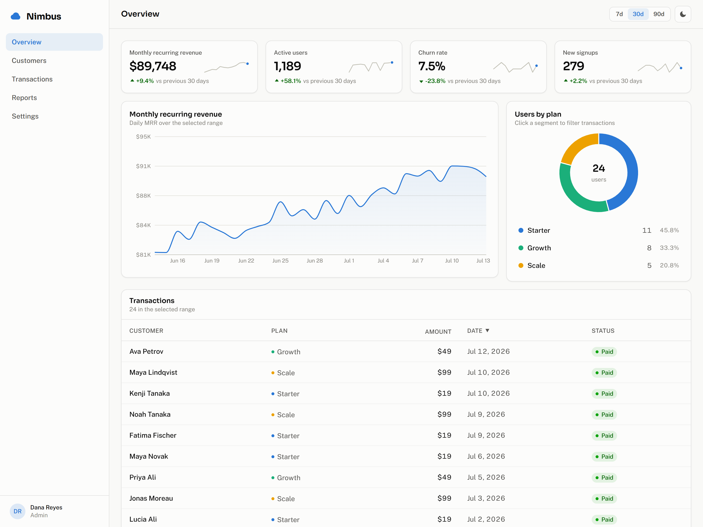
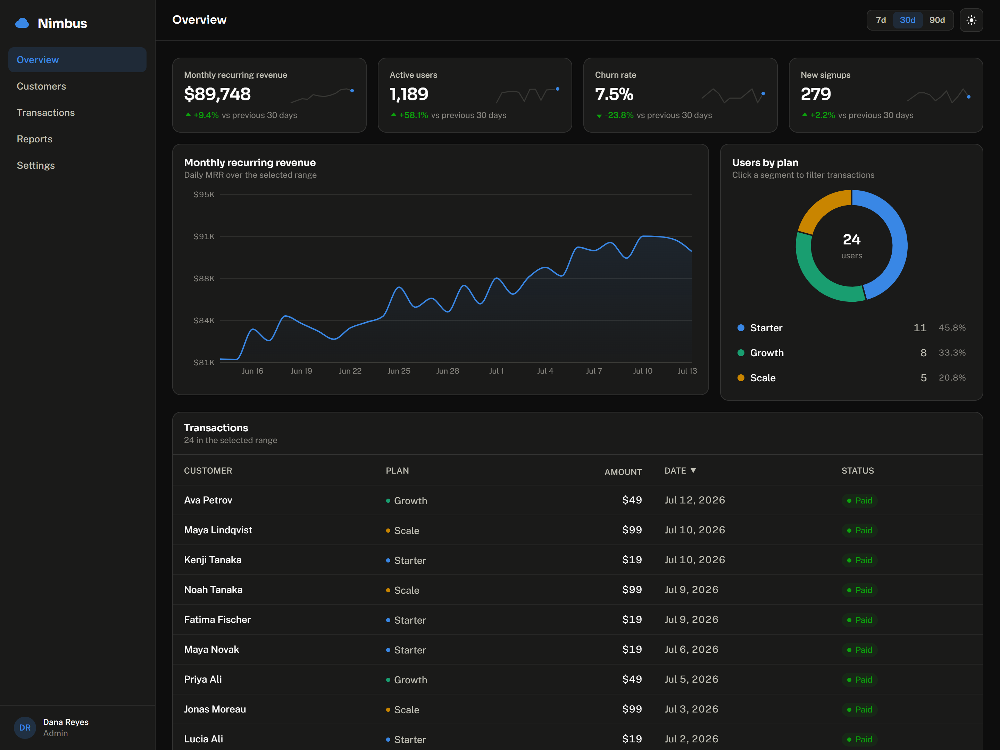

# Nimbus — Analytics Dashboard

Analytics dashboard for a fictional subscription business — surfaces MRR, churn,
and plan mix at a glance, with a date-range filter driving the whole view and a
click-to-drill-down from plan breakdown into the underlying transactions. Built
with React, TypeScript, and Recharts; focus was on making the data interaction
feel like a real product, not a static report.

**Live demo:** https://analytics-dashboard-mu-murex.vercel.app/

## What this demonstrates

A subscription dashboard is a common portfolio project, so the goal was to get
the details right — the ones that separate a real product surface from a
tutorial build:

- **Tested domain logic, not just UI.** KPI math, date-range windows, the
  per-customer roll-up, and table sorting are pure, framework-free modules
  covered by 48 unit tests. The React layer is a thin shell over logic that's
  verified in isolation.
- **Deterministic by design.** Every value comes from a seeded PRNG (mulberry32)
  anchored to a fixed date, so the app renders identically on every reload —
  dependable for screenshots, review, and tests, with no backend to run.
- **Accessibility as a requirement.** `aria-sort` on sortable headers, the donut
  mirrored as a keyboard-navigable legend, focus restored to a stable element
  when a drill-down filter is cleared, WCAG AA-tuned status pills, and full
  `prefers-reduced-motion` support.
- **Product decisions, not just charts.** Churn is normalized to a 30-day rate so
  the 7/30/90-day ranges stay comparable, the churn KPI inverts its delta color
  (down is good), and loading skeletons and empty states are first-class.
- **Real client-side routing.** Five views with genuine URLs, back/forward, and
  refresh-safe deep links, plus a responsive layout that collapses the sidebar
  into a mobile nav.
- **One source of visual truth.** A single validated color palette and CSS design
  tokens drive both themes; dark mode persists with no flash-of-wrong-theme via a
  pre-paint script.

*The same Overview in dark mode:*

## Stack

React 19 · TypeScript · Vite · Tailwind CSS v4 · Recharts · date-fns · Vitest

## Highlights

- Five routed views (Overview, Customers, Transactions, Reports, Settings) with
  real URLs, back/forward, and refresh-safe deep links (react-router + SPA rewrite)
- Seeded mock data (mulberry32 PRNG, fixed anchor date) — 180 days of metrics with
  weekend dips, a growth trend, and churn spikes; identical on every reload
- A global `dateRange` filter scopes every data view — KPI deltas, the revenue
  chart, the plan donut, the customers roll-up, and the transactions table
- Donut segment click drills into the table with a clearable filter chip and a
  considered empty state; Transactions adds plan/status filters; Reports exports
  the visible transactions to CSV client-side
- Customers view rolls transactions up per account (plan, total spend, activity)
  with the same sortable-table treatment
- Dark mode (persisted, no flash-of-wrong-theme), loading skeletons,
  Intl-formatted currency/percent values, churn KPI normalized to a 30-day rate
- Unit-tested data generation, KPI math, range windows, and sorting (`npm test`)

## Develop

    npm install
    npm run dev        # http://localhost:5173

## Test & build

    npm test           # vitest, 41 tests
    npm run build      # tsc --noEmit && vite build

## Project shape

- `src/data/mockData.ts` — seeded generator (metrics, transactions, plan breakdown)
- `src/lib/` — pure, tested logic: range windows, KPI computation, customer roll-up, Intl formatters, sorting
- `src/components/` — presentational components (charts, table, KPI tiles, controls)
- `src/views/` — one component per route (Overview, Customers, Transactions, Reports, Settings)
- `src/App.tsx` — owns `dateRange` / dark-mode state and the route table; views read shared
  state from the layout's `<Outlet>` context and derive the rest
